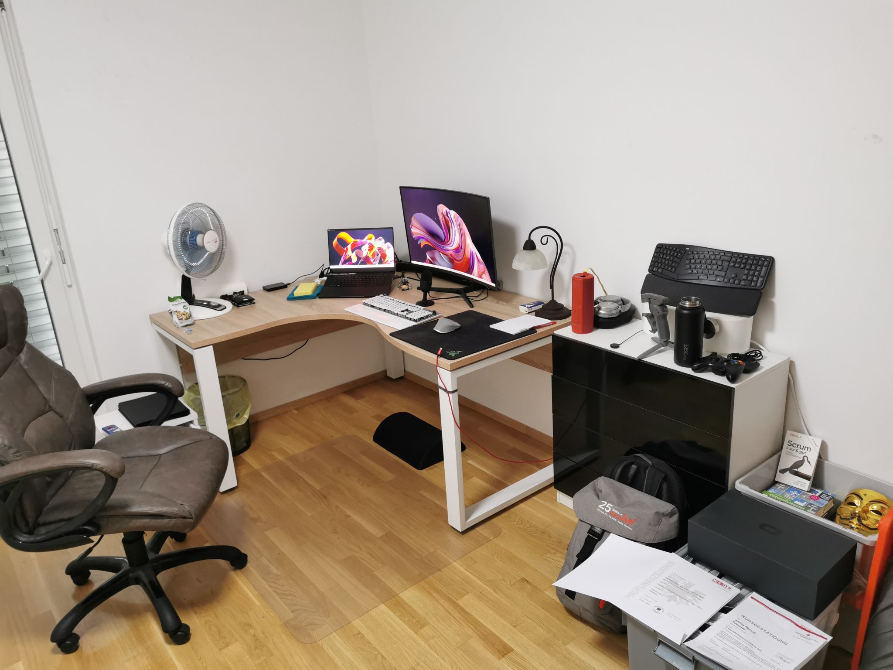
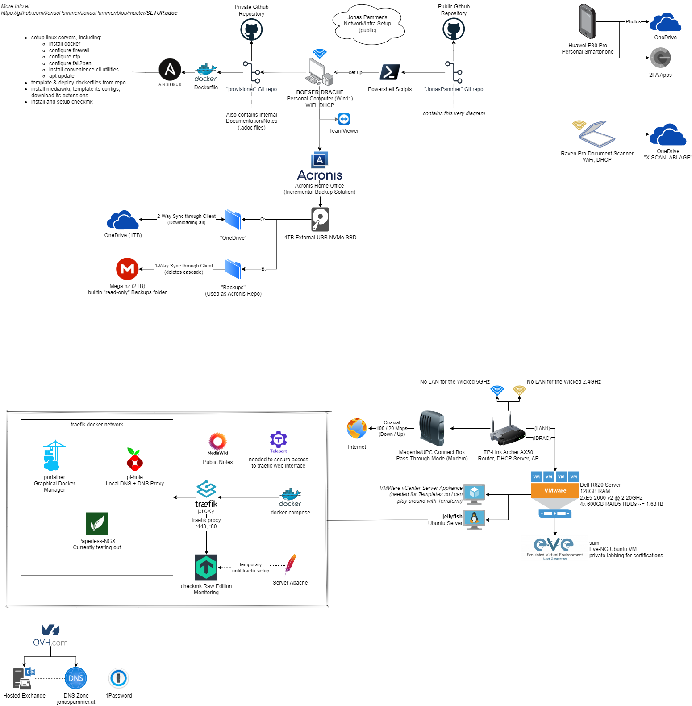

PC (not pictured)::
Got rid of Gaming Laptop - was a bad idea i will never recommend to anyone. Battery life is miserable and heat is a problem.
My model had its chassis bent because of the battery right after warranty voided, causing me to spend 140€ for a replacement from official support (pictured above, black OLED RTX 3090 model. Initial one was a Mercury White RTX 2070). +
Now got a normal 1000€~ Tower PC again (32GB RAM, RTX 3070),
inspired by https://www.hardwaredealz.com/bester-gaming-pc-fuer-unter-1000-euro-gamer-pc-bis-1000-euro[this config].
__self-configured and bought as a tested- and built package (to avoid troubles) at https://www.dubaro.de__

Samsung 34" Curved Monitor::
no comment, really. just made a quick and in-need buy at local electronics shop

Roccat Vulcan Keyboard, German Layout::
Felt the most nice at local electronics shop. White is nice. Really often use the sound wheel at the right top.

Logitech MX Master 2::
Heart of the setup, still going strong

Razer Seiren Mini::
Best 50€ Microphone according to some YouTube videos...

UE Megaboom Speaker::
Also heart of the setup, still going strong even though all it's been through. It's waterproof³.

Bose QuietComfort 35 Noise Cancelling Headset::
__Preferred over the Sony equivalent because of my Glasses.__

Huawei P30 Pro::
Was https://www.notebookcheck.net/The-Best-Camera-Smartphones.283106.0.html[the best camera smartphone] at the time.

Rowenta Fan::
Very quiet

Chair::
Cheap Moebelix Chair

Hilti Bottle::
//Thanks to who'm I got to know about many interesting things about IT's day-to-day in a big corporation.

== Work Setup

2 Monitors. Ergonomic Chair :)

Cherry Keyboard with Brown Switches::
Gifted by a colleague who didn't want it.
Has the thing i like: RGB is able to be disabled and only react to key press.

== Server / Infra

Dell R620::
I used to have a Root Server over at Hetzner and then OVH for years,
then I noticed I've spent wayyyyyy to much money and got my own.
It's the same one i used for
https://www.linkedin.com/in/jonas-pammer-2b340a1aa/#education[my IT school project].
Very quiet.

I still have my E-Mail Server on OVH though because
I want my E-Mails to just work (be trusted / delivered)
and not care about configuration / maintenance of it.

Also have my DNS at OVH for convenience.
